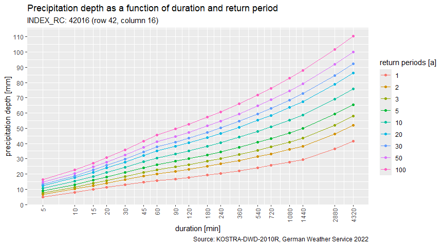

<!-- README.md is generated from README.Rmd. Please edit that file -->

# kostra2010R

<!-- badges: start -->

[](https://github.com/dimfalk/kostra2010R/actions/workflows/R-CMD-check.yaml)
[](https://app.codecov.io/gh/dimfalk/kostra2010R?branch=main)

<!-- badges: end -->

— As of 01.01.2023, kostra2010R is officially replaced by
[kostra2020](https://github.com/dimfalk/kostra2020). —

The main goal of kostra2010R is to provide access to KOSTRA-DWD-2010R
dataset from within R.

Abstract (slightly modified) from the [official dataset
description](https://opendata.dwd.de/climate_environment/CDC/grids_germany/return_periods/precipitation/KOSTRA/KOSTRA_DWD_2010R/gis/DESCRIPTION_gridsgermany_return_periods_precipitation_KOSTRA_KOSTRA_DWD_2010R_gis_en.pdf):

> This vector dataset contains statistical precipitation values as a
> function of duration and return period. The scope of the data is the
> engineering dimensioning of water management structures. These
> include, sewerage networks, sewage treatment plants, pumping stations
> and retention basins. They are also often used for the dimensioning of
> drainage and infiltration systems. With the help of the data, however,
> it is also possible to estimate the precipitation level of severe
> heavy precipitation events with regard to their return periods. This
> estimation is often used to assess damage events.

> The dataset encompasses values of statistical precipitation (HN) for
> 18 duration levels D (5 min - 3 days) and 9 return periods Tn (1-100
> a) for the whole grid spanning 79 × 107 cells. INDEX_RC describes the
> unique identifier of a grid cell.

## Installation

You can install the development version of kostra2010R with:

``` r
# install.packages("devtools")
devtools::install_github("dimfalk/kostra2010R")
```

and load the package via

``` r
library(kostra2010R)
#> 0.13.2
```

## Getting started

### Get “INDEX_RC” based on row and column information

Sometimes identification of grid cells is not accomplished using
“INDEX_RC” directly but rather using a combination of X and Y
information (e.g. row 49, column 11). This information can easily be
used to generate the necessary “INDEX_RC” field.

``` r
# Generate "INDEX_RC" based on row and column information.
idx_build(row = 42, col = 16)
#> [1] "42016"
```

If you wanted to check whether this constructed “INDEX_RC” field is
really present in the dataset (or you found an ID in some report and are
not sure, if it is still being used), make use of the following
function.

``` r
# Is the following "INDEX_RC" entry present in the dataset?
idx_exists("42016")
#> [1] TRUE
```

### Get “INDEX_RC” based on spatial information

The most common use case will be to get the relevant “INDEX_RC” based on
coordinates provided, e.g. for the location of a precipitation station
in order to be able to classify duration-specific precipitation depths
in terms of return periods.

``` r
# Sf objects created based on specified coordinates. Don't forget to pass the CRS.
p1 <- get_centroid(c(6.09, 50.46), crs = "epsg:4326")
p1
#> Geometry set for 1 feature 
#> Geometry type: POINT
#> Dimension:     XY
#> Bounding box:  xmin: 6.09 ymin: 50.46 xmax: 6.09 ymax: 50.46
#> Geodetic CRS:  WGS 84
#> POINT (6.09 50.46)

p2 <- get_centroid(c(367773, 5703579), crs = "epsg:25832")
p2
#> Geometry set for 1 feature 
#> Geometry type: POINT
#> Dimension:     XY
#> Bounding box:  xmin: 367773 ymin: 5703579 xmax: 367773 ymax: 5703579
#> Projected CRS: ETRS89 / UTM zone 32N
#> POINT (367773 5703579)
```

For convenience, it is also possible to provide municipality names,
postal codes or full addresses to be geocoded via Nominatim API.

``` r
# Sf objects created based on Nominatim API response. Internet access required!
p3 <- get_centroid("40477")
p3
#> Geometry set for 1 feature 
#> Geometry type: POINT
#> Dimension:     XY
#> Bounding box:  xmin: 6.785413 ymin: 51.23875 xmax: 6.785413 ymax: 51.23875
#> Geodetic CRS:  WGS 84
#> POINT (6.785413 51.23875)

p4 <- get_centroid("Freiburg im Breisgau")
p4
#> Geometry set for 1 feature 
#> Geometry type: POINT
#> Dimension:     XY
#> Bounding box:  xmin: 7.8494 ymin: 47.99609 xmax: 7.8494 ymax: 47.99609
#> Geodetic CRS:  WGS 84
#> POINT (7.8494 47.99609)

p5 <- get_centroid("Kronprinzenstr. 24, 45128 Essen")
p5
#> Geometry set for 1 feature 
#> Geometry type: POINT
#> Dimension:     XY
#> Bounding box:  xmin: 7.020153 ymin: 51.44617 xmax: 7.020153 ymax: 51.44617
#> Geodetic CRS:  WGS 84
#> POINT (7.020153 51.44617)
```

These coordinates can be used subsequently to spatially query the
relevant grid index.

``` r
# Get indices by topological intersection between location point and grid cells.
get_idx(p1)
#> [1] "61002"
get_idx(p2)
#> [1] "49011"
get_idx(p3)
#> [1] "51008"
get_idx(p4)
#> [1] "94016"
get_idx(p5)
#> [1] "49010"
```

### Construct cell-specific statistics from KOSTRA-DWD-2010R grid

Now that we have messed a little with the grid cell identifiers, let’s
get a sneak peek into the dataset itself based on the “INDEX_RC”
specified.

``` r
# Build a tibble containing statistical precipitation depths as a function of 
# duration and return periods for the grid cell specified.
stats <- get_stats("42016")

stats
#> # A tibble: 18 × 12
#>    D_min D_hour D_day HN_001A HN_002A HN_003A HN_005A HN_010A HN_020A HN_030A
#>    <dbl>  <dbl> <dbl>   <dbl>   <dbl>   <dbl>   <dbl>   <dbl>   <dbl>   <dbl>
#>  1     5   NA      NA     4.9     6.6     7.6     8.9    10.6    12.3    13.3
#>  2    10   NA      NA     7.9    10.1    11.4    13.1    15.3    17.5    18.8
#>  3    15   NA      NA     9.8    12.4    14      15.9    18.5    21.1    22.7
#>  4    20   NA      NA    11.2    14.1    15.8    18      20.9    23.9    25.6
#>  5    30   NA      NA    13      16.4    18.4    21      24.4    27.9    29.9
#>  6    45   NA      NA    14.6    18.6    21      23.9    28      32      34.4
#>  7    60    1      NA    15.5    20      22.7    26      30.6    35.1    37.7
#>  8    90    1.5    NA    16.8    21.8    24.6    28.3    33.2    38.1    41  
#>  9   120    2      NA    17.8    23.1    26.1    30      35.2    40.5    43.5
#> 10   180    3      NA    19.3    25      28.4    32.6    38.3    44      47.3
#> 11   240    4      NA    20.5    26.6    30.1    34.6    40.6    46.7    50.2
#> 12   360    6      NA    22.2    28.8    32.7    37.6    44.1    50.7    54.6
#> 13   540    9      NA    24.1    31.3    35.5    40.8    48      55.2    59.4
#> 14   720   12      NA    25.6    33.2    37.7    43.3    50.9    58.5    63  
#> 15  1080   18      NA    27.7    36      40.9    47      55.3    63.6    68.5
#> 16  1440   24       1    29.4    38.2    43.4    49.9    58.7    67.5    72.7
#> 17  2880   48       2    36.5    46.3    52      59.3    69.1    78.9    84.6
#> 18  4320   72       3    41.4    51.8    57.9    65.5    75.9    86.3    92.4
#> # ℹ 2 more variables: HN_050A <dbl>, HN_100A <dbl>
```

Some describing attributes have been assigned to the tibble.

``` r
attr(stats, "id")
#> [1] "42016"
attr(stats, "period")
#> [1] "1951-01-01 +01" "2010-12-31 +01"
attr(stats, "returnperiods_a")
#> [1]   1   2   3   5  10  20  30  50 100
attr(stats, "source")
#> [1] "KOSTRA-DWD-2010R"
```

### Get precipitation depths, calculate precipitation yield

If we now wanted to know the statistical precipitation depth e.g. for an
event of 4 hours duration corresponding to a recurrence interval in
1:100 years, it’s just a matter of indexing. However, there is a
function helping you out.

``` r
# So we are interested in the rainfall amount [mm] for an event lasting 240 min 
# with a return period of 100 a.
get_depth(stats, d = 240, tn = 100)
#> 60.7 [mm]
```

In order to respect statistical uncertainties, as proposed in Malitz &
Ertel (2015), ranging between 10 % and 20 % as a function of the chosen
return period, make use of `uc = TRUE` to get an interval centered
around the single value above.

``` r
# Same data, but with uncertainties considered.
get_depth(stats, d = 240, tn = 100, uc = TRUE)
#> Units: [mm]
#> [1] 48.6 72.8
```

If you need precipitation yield values \[l/(s\*ha)\] instead of
precipitation depth \[mm\] or vice versa, make use of the following
helper function.

``` r
as_yield(62.1, d = 240)
#> 43.1 [L/ha/s]

as_depth(43.1, d = 240)
#> 62.1 [mm]
```

### Get return periods

Finally, we want to determine the return period according to the dataset
for a precipitation depth and duration given.

``` r
# Let's assume we measured 75.2 mm in 24 h.
get_returnp(stats, hn = 75.2, d = 1440)
#> Units: [a]
#> [1] 30 50
```

Accordingly, the approximate corresponding recurrence interval resp.
annuality of this event amounts to something between 30 and 50 years as
per KOSTRA-DWD-2010R.

The following edge cases are to be mentioned:

``` r
# 1) In case a class boundary is hit, the return period is replicated.
get_returnp(stats, hn = 38.2, d = 1440)
#> Units: [a]
#> [1] 2 2
```

``` r
# 2) In case the return period tn is smaller than 1, interval opens with 0.
get_returnp(stats, hn = 26.4, d = 1440)
#> Units: [a]
#> [1] 0 1
```

``` r
# 3) In case the return period tn is larger than 100, interval closes with Inf.
get_returnp(stats, hn = 92.8, d = 1440)
#> Units: [a]
#> [1] 100 Inf
```

### Return period interpolation

Although it may be somewhat questionable from a scientific perspective,
you might nevertheless be interested in the return period estimated
using linear interpolation between adjacent nodes:

``` r
# Using the same example as above, previously resulting in 30 a < tn < 50 a.
get_returnp(stats, hn = 75.2, d = 1440, interpolate = TRUE)
#> 37.7 [a]
```

### Further utilization

Data can additionally be visualized as intensity-duration-frequency
curves using `plot_idf()`, underpinned by `{ggplot2}` …

``` r
plot_idf(stats, log10 = TRUE)
```



… or exported to disk using `write_stats()` based on `write.table()`.

## Contributing

See
[here](https://github.com/dimfalk/kostra2010R/blob/main/.github/CONTRIBUTING.md)
if you’d like to contribute.
